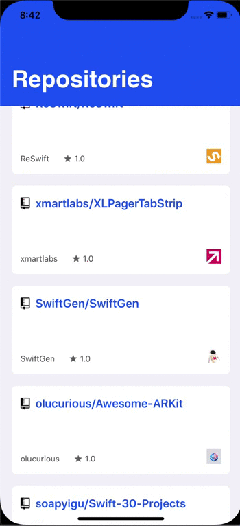

# Swift-Git

### Configurações basicas

Arquitetura:
  Swift 5 - 
  Xcode 11.5 - 
  Cocoapods 1.9.3 - 
  Versão minima do iOS 11
 
 ### Detalhes
 
 Projeto desenvolvido com base na arquitetura MVVM, podendo facilmente ser escalado, como bibliotecas foram utilizados Quick/Nimble para implementação dos testes, Alamofire para camada de networking e SnapKit para escrita de constraints.
 
 
 ### Exemplo:
 
 
 
 
  ### OBS:
    1 - Para rodar o projeto basta clonar ou baixar como zip, acessar a pasta raiz e rodar pod install 
    2 - Para rodar as lanes basta acessar a branch **feature-fastlanes**

  
  
